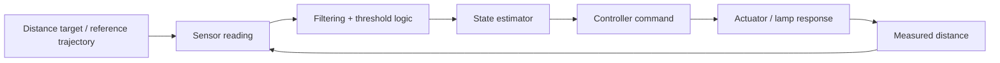

# Lab 02 Summary Report

## Objective
This report summarizes the student controller comparison for the simulated robust reactive lamp experiment. The comparison used the same reference trajectory with noise sigma = 0.01 m and delay = 0 ms across 5 repeated trials per condition.

## Block diagram

## Key results

| Condition | Enter latency (s) | Exit latency (s) | Recovery time (s) | False triggers / min | Extra switches | Mean abs command change |
|---|---:|---:|---:|---:|---:|---:|
| C1 | 0.0189 | 0.0291 | 0.1806 | 8.39 | 12.4 | 0.00864 |
| C2 | 0.4069 | 0.4531 | 0.4543 | 0.00 | 0.0 | 0.00120 |

## Interpretation
- C1 responds quickly to the physical crossing because it uses a single threshold on the raw sensor value. This gives a lower enter latency, but it also produces frequent switching and high false-trigger rate under sensor noise.
- C2 uses a low-pass filter plus hysteresis around the threshold band. This delays the response compared with C1, but it suppresses chatter and maintains a stable state near the threshold.
- The trade-off is clear: C1 favors responsiveness, while C2 favors robustness and stability.

## Representative trial plots
- C1 plot: [plots/C1_n0.01_d000_r01.png](plots/C1_n0.01_d000_r01.png)
- C2 plot: [plots/C2_n0.01_d000_r01.png](plots/C2_n0.01_d000_r01.png)

## Conclusion
For the provided lab scenario, C1 is faster but noisy, while C2 is slower but substantially more stable. This behavior matches the expected tradeoff between raw-threshold switching and filtered hysteretic control.
